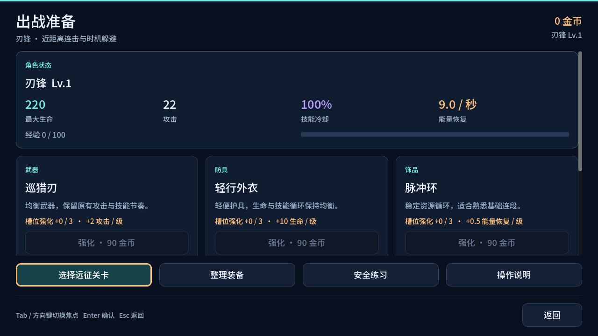
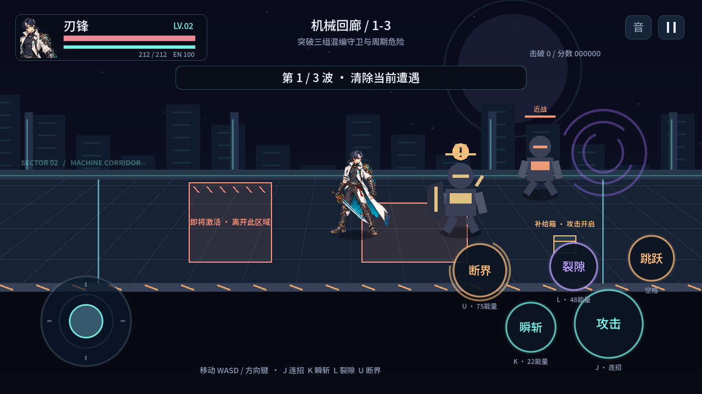

# 裂隙猎人 · Time Hunter Offline

Godot 4.5.2 制作的 Android 原创离线横版格斗游戏。当前为 **v0.3.0「遗落港远征」**：保留刃锋与已重设计的技能特效，完成一章三关的准备、战斗、结算、装备、成长与再次挑战流程。无需服务器。



## 当前玩法

- 三关独立结算：遗迹外围教授距离与躲避；机械回廊组合重装、射手、冲锋与周期危险；核心大厅以短热身进入两阶段 Boss。
- 四类普通敌人有明确前摇与恢复窗口。重装可绕后或用普攻第三段破防；冲锋锁定路线；射手先瞄准；Boss 使用横扫、冲锋与标记地面，半血后改变顺序并增加双落点。
- 武器、防具、饰品三个槽位，6 件初始选择与3件首通装备。背包提供部位/新获得筛选、属性对比、穿脱、锁定、确认处置和关键装备保护。
- 连击输出与反击生存两种被动；裂隙广域/聚焦、断界标准/精准在范围与伤害间取舍。装备改变生命、攻击、冷却与能量恢复。
- 通关获得经验和金币；首通必得装备并解锁下一关，首通外围解锁断界。等级上限 Lv.11，槽位强化上限 +3，成本与结果固定。
- 每关有一个可攻击开启的补给箱，额外8金币只在胜利时入账。
- 胜利、失败、退出与重试均有明确出口；训练场免费试用全技能，不发放奖励。
- 全菜单支持键盘焦点导航和鼠标/触屏；战斗保留横屏摇杆、多点触控、按住攻击与技能输入缓冲。
- 设置支持音量、静音、震动、闪光、火花数量、伤害数字、大字、桌面全屏与按键重映射。

| 关卡 | 常规通关：金币 / 经验 | 额外首通：金币 / 经验 | 必得装备与解锁 |
| --- | --- | --- | --- |
| 遗迹外围 | 45 / 45 | 60 / 60 | 双锋刃、断界、机械回廊 |
| 机械回廊 | 70 / 75 | 85 / 75 | 逆击甲、核心大厅 |
| 核心大厅 | 110 / 105 | 120 / 100 | 时序晶核、第一章完成 |



## 存档与中断

进度保存在本机 `user://progress.json`。更换装备、配置、强化和设置立即保存；出战记录先保存，再开始战斗。安全断点在遭遇开始前保存。后台、失焦与暂停冻结战斗并清除旧输入；重开游戏继续时，从最近安全遭遇恢复满生命、满能量和零冷却，该遭遇与未入账补给重新开始。

只有通关结算成功后才显示奖励已到账。金币、经验、装备、首通、关卡解锁和出战完成作为一次事务保存，同次出战无法重复领奖。失败与退出不扣已有成长，只放弃本次未结算收益；失败页可按同一随机种子从检查点重新挑战。

存档采用版本校验、临时文件回读、替换与有效备份。保存失败回滚内存变化，结算页可重试。旧版进度保留金币、等级和原有技能。主文件损坏时恢复有效备份；无法识别的文件保留，新游戏前说明覆盖范围并确认。

## 运行与安装

使用 Godot 4.5.2 Standard 打开 `project.godot`，按 F5 运行。默认 WASD / 方向键移动、J 攻击、K 瞬斩、L 裂隙、U 断界、空格跳跃、Esc 暂停。菜单用 Tab / 方向键切换、Enter 确认、Esc 返回。可在设置修改战斗按键。

```sh
godot --path .
godot --headless --path . --editor --import --quit
godot --headless --path . --script res://tests/run_tests.gd
godot --headless --path . --script res://tests/progression_test.gd
godot --headless --path . --script res://tests/campaign_combat_test.gd
godot --headless --path . --script res://tests/campaign_ui_test.gd
godot --headless --path . --script res://tests/campaign_flow_test.gd
godot --headless --path . --script res://tests/skill_buffer_test.gd
godot --headless --path . --script res://tests/skill_vfx_test.gd
CAPTURE_DIR=/tmp/rift-hunter-campaign godot --path . --script res://tests/campaign_capture.gd
```

Android 支持 API 24 及以上、ARM64 / ARMv7，APK 无网络、存储、相机或麦克风权限。本机调试构建复用 `.tools/debug.keystore`，可覆盖更新此前同签名版本。GitHub Actions 的 `Android APK` 工作流提供构建 Artifact；CI 临时签名可能无法覆盖本机版本。正式发布需要稳定的发布密钥。

打包步骤见 [Android 说明](docs/mobile-build.md)，本轮变更与验证见 [P0 实现记录](docs/gameplay-p0.md)。

## 项目与验证

`game_content.gd` 定义关卡与物品；`arena_model.gd` 负责判定；`save_store.gd` 负责进度与事务；`campaign_ui.gd` 负责原生菜单；`input_bindings.gd` 负责按键；`main.gd` 接通流程、绘制、触控与音效。角色和特效由 `hero_renderer.gd`、`combat_vfx.gd`、`combat_audio.gd` 表现。

模型、存档、场景流程、界面与技能回归共522项检查通过，另有37项图形与输入检查。截图来自实际 Godot Compatibility 渲染，包括1280×720与960×540大字布局；受控清敌用于验证流程，不代表真人通关或难度测评。Android 真机性能、触屏手感和长时间稳定性仍需设备测试。角色使用八姿势图集与插值，场景和敌人主要由程序几何绘制。

此前技能改造见 [设计记录](docs/skill-vfx-design.md) 与 [运行预览](docs/skill-vfx-showcase.gif)。字体和引擎许可见 [第三方说明](docs/third-party.md)。
