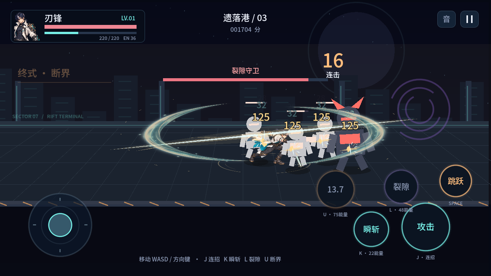

# 裂隙猎人 · Time Hunter Offline

以《时空猎人》的横版刷图体验为玩法参考，制作可离线运行的 **Android 原创单机格斗游戏**。当前是 **v0.2.0「刃锋 · 断界」可玩原型**：一名角色、一张地图和三波战斗，包含最终 Boss。刃锋采用原创原画与透明动作图集，技能已按动作、表现、判定分层重新设计，配合银青折光刀光、程序绘制场景及合成音效；无需服务器。目前只开发 Android，暂不生成 iOS 代码或打包配置。



## 当前内容

- 刃锋：米白非对称外套、墨蓝银色挑染、单侧机械护臂与折光刃；主界面立绘、HUD 肖像和八姿势战斗图集。
- 三段普攻在刀刃接触时结算，第三击挑空；冲刺残影、刀光、火花、浮动伤害、敌人受击闪白与速度击退。
- 命中停顿冻结战斗与角色动作，配合镜头震动和缓存的刀刃 / 重击 / 蓄力音效。
- 重做技能刀光：银青普攻、收束瞬斩残影、紫青三段裂隙和金白断界；手部挂点、世界坐标剑带及释放音效与命中时点同步。暂停与命中停顿同时冻结特效，挥空不触发命中震动。
- 按住攻击时点技能，会在当前普攻结束后优先释放，再恢复连招；缓存随暂停和受伤打断清除。
- 横屏触屏摇杆与多点触控，可以同时移动、攻击和施放技能。
- 跳跃躲避攻击，生命值、能量恢复、技能冷却与连击计分。
- 近战机械兵、远程机械兵与带落点预警的裂隙守卫 Boss。
- 生命拾取、胜负结算、晶币强化、最高分与本机存档。
- 暂停、返回基地、静音；应用切到后台后自动暂停。
- Android APK 导出配置、签名验证脚本、GitHub Actions 构建流程。

| 技能 | 表现与判定 | 能量 / 冷却 |
| --- | --- | --- |
| 瞬斩 · 折光穿袭 | 快速突进 285 像素，沿途每名敌人命中一次，带残影与刀光 | 22 / 3.5 秒 |
| 裂隙 · 三重连斩 | 蓄力后连续三段范围斩，挑空后重击击退，并清除范围内弹幕 | 48 / 7 秒 |
| 终式 · 断界 | 角色特写、蓄力、三次空间切割与第四段重击终结，施放期间无敌 | 75 / 15 秒 |

## 安装与平台状态

Android 调试 APK 已在 macOS 构建并通过签名和 Manifest 检查。支持 Android 7.0（API 24）及以上、ARM64 / ARMv7；实际性能仍需在手机上测试。APK 没有 INTERNET、存储、相机或麦克风权限。首次安装时，在手机系统中允许对应文件管理器安装应用，再打开 APK。

GitHub 构建成功后，可在 Actions 的 `Android APK` 运行记录中下载 `rift-hunter-android-debug` Artifact，解压获得 APK。调试签名用于个人测试；正式发布需配置自己的稳定签名密钥。CI 每次生成新的调试密钥，跨次构建的 APK 可能不能直接覆盖安装；本机脚本保留 `.tools/debug.keystore` 以便后续覆盖更新。

详见 [Android 打包说明](docs/mobile-build.md)。

## 开发运行

使用 **Godot 4.5.2 Standard**（GDScript，不需要 .NET）打开 `project.godot`，按 F6 / F5 运行。导出模板需与引擎版本一致。

```sh
godot --path .
godot --headless --path . --editor --import --quit
godot --headless --path . --script res://tests/run_tests.gd
godot --headless --path . --script res://tests/skill_buffer_test.gd
godot --headless --path . --script res://tests/skill_vfx_test.gd
CAPTURE_DIR=/tmp/rift-hunter-capture godot --path . --script res://tests/capture.gd
CAPTURE_DIR=/tmp/rift-hunter-vfx godot --path . --script res://tests/skill_vfx_capture.gd
```

键盘调试：WASD / 方向键移动，J 攻击，K 瞬斩，L 裂隙连斩，U 断界，空格跳跃，Esc 暂停，Enter 出击。手机使用屏幕摇杆和技能按钮；长按攻击可连续普攻。

## 项目结构

```text
project.godot         Godot 工程入口
scenes/main.tscn     主场景
scripts/arena_model.gd  战斗状态、判定、敌人 AI、波次
scripts/fighter.gd      角色状态
scripts/main.gd         画面、HUD、触屏输入、音效
scripts/hero_renderer.gd 原创动作图集、脚底定位、镜像与残影
scripts/combat_vfx.gd   多层刀光、能量环、命中与终结特效
scripts/combat_audio.gd 缓存的合成战斗音效
scripts/save_store.gd   存档与强化
assets/characters/     原创刃锋原画、动作图集与实际生成提示词
assets/effects/        透明能量刀光
tests/run_tests.gd      74 项战斗 / 存档检查
tests/skill_buffer_test.gd 18 项技能缓存场景检查
tests/capture.gd        图形运行与多点触控检查、截图
tests/hero_visual_test.gd 八姿势双向渲染检查
tools/build_android.py 测试、APK 导出与签名验证
export_presets.cfg     Android 导出预设
```

## 验证边界与后续开发

已完成 Godot 4.5.2 导入与运行、74 项战斗 / 存档检查、18 项技能缓存场景检查、25 项图形 / 输入 / 截图检查，以及八姿势双向渲染检查。v0.2.0 Android APK 已构建，v2/v3 签名、版本、架构、无权限声明与新增资源检查通过，沿用本机 v0.1.0 包的签名以支持覆盖更新。桌面触控事件检查不能替代手机真机测试，GitHub Actions 也需以实际运行结果为准。

当前角色使用八姿势 2D 动作图集与程序插值，左右移动采用镜像，尚未制作完整骨骼动画；敌人和场景仍以程序几何绘制为主。后续可扩展动画帧、职业、装备、地图与剧情，并根据 Android 真机反馈调整性能和手感。

字体和引擎许可见 [第三方说明](docs/third-party.md)。

技能重设计及验证说明见 [设计记录](docs/skill-vfx-design.md)，[实际运行预览](docs/skill-vfx-showcase.gif) 包含左右朝向的普攻、瞬斩、裂隙与断界。
